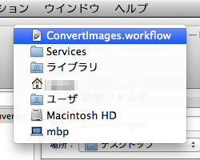
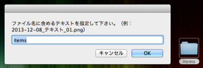

# Automator Workflows

Mac OS X に付属する Automator.app の Workflow コレクションです。

* [ConvertImages.workflow](https://github.com/DriftwoodJP/automator-workflows/tree/master#convertimagesworkflow)
* [RenameFiles.workflow](https://github.com/DriftwoodJP/automator-workflows/tree/master#renamefilesworkflow)
* [OpenInTerminal.app](https://github.com/DriftwoodJP/automator-workflows/tree/master#openinterminalapp)

なお Workflow には、「システム環境設定」→「キーボード」→「キーボードショートカット」→「サービス」から、ショートカットを割り当てることができます。

## インストール

[zipファイル](https://github.com/DriftwoodJP/automator-workflows/archive/master.zip)をダウンロードし、下記のディレクトリへ利用したい .workflow ファイルを移動して下さい。

`/Users/****/Library/Services/`

## ConvertImages.workflow

* ImageOptim.app を利用して、画像ファイルを最適化します。
* 指定されたピクセルサイズまでアスペクト比を保ったまま縮小します。
* 画像縮小は、縦・もしくは横の内、最も長い辺を基準とします。

### 必要条件

画像ファイル最適化のために、[ImageOptim.app](http://imageoptim.com/) のインストールが必要です。

### 使い方

* 画像ファイル、もしくはフォルダを選択します。
* `ctrl+click`（2本指タップ、右クリック）で表示されるメニューから、`サービス` - `ConvertImages` を選択します。  

* 最大の画像幅をピクセルで指定します。  

* デスクトップの `ConvertImages` フォルダに変換された画像がコピーされます。

## RenameFiles.workflow

* 指定したファイルのファイル名を「年月日」「指定したテキスト」「連番」という形式にリネームします。  
`YYYY-MM-DD_[text]_NN.EXTENTION`
* ファイルは作成日順に連番されます。

Automator.app で、条件の変更が可能です。

### 使い方

* ファイル、もしくはフォルダを選択します。
* `ctrl+click`（2本指タップ、右クリック）で表示されるメニューから、`サービス` - `RenameFiles` を選択します。  
* ファイル名に含める共通のテキストを指定します。  
フォルダが指定されていればフォルダ名、ファイルの場合はファイル名が初期値に入ります。  

* デスクトップの `RenameFiles` フォルダに変換されたファイルがコピーされます。

## OpenInTerminal.app

利用しやすいようアプリ形式で用意しました。  
設定を確認して下さい。

* Finder で開いているディレクトリを Terminal.app で開きます。
* ディレクトリ foo を Terminal.app で表示するために、アプリ起動と `$ cd foo` します。

### 設定

使いやすくするために簡単な設定をします。

* 標準では `Otto (the Automator robot)` のアイコンが表示されます。  
`cmd+i` で開いたウィンドウから、コピー＆ペーストでアイコンを変更できます。  
  
ここでは Terminal.app のアイコンを利用しました。
* アプリを Finder のツールバーに登録します。  

* 登録が終わったら、アプリケーションフォルダーに移動して完了です。  

### 使い方

* Finder ツールバーのアプリアイコンをクリックします。  

### OpenInTerminal.workflow

.workflow 形式のファイルも用意しました。  
選択したファイル・フォルダーの上位ディレクトリが開きます。
