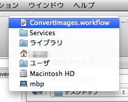
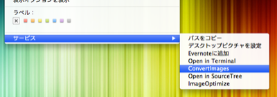
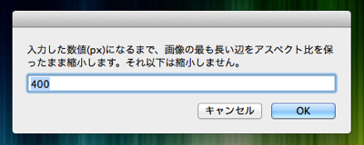

# Automator Workflows

Mac OS X に付属する Automator.app の Workflow コレクションです。

* [ConvertImages.workflow](https://github.com/DriftwoodJP/automator-workflows/tree/master#convertimagesworkflow)

なお Workflow には、「システム環境設定」→「キーボード」→「キーボードショートカット」→「サービス」から、ショートカットを割り当てることができます。

## ConvertImages.workflow

* ImageOptim.app を利用して、画像ファイルを最適化します。
* 指定されたピクセルサイズまでアスペクト比を保ったまま縮小します。
* 画像縮小は、縦・もしくは横の内、最も長い辺を基準とします。

### インストール

[zipファイル](https://github.com/DriftwoodJP/automator-workflows/archive/master.zip)をダウンロードし、下記のディレクトリへファイルを移動して下さい。

`/Users/****/Library/Services/ConvertImages.workflow`

### 必要条件

画像ファイル最適化のために、[ImageOptim.app](http://imageoptim.com/) のインストールが必要です。

### 使い方

* 画像ファイル、もしくはフォルダを選択します。
* 右クリックメニューから、`サービス` - `ConvertImages` を選択します。  

* 最大の画像幅をピクセルで指定します。  

* デスクトップの `ConvertImages` フォルダに変換された画像が保存されます。
