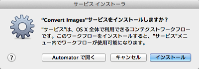

# Automator Workflows

Mac OS X に付属する Automator.app の Workflow コレクションです。

* [Convert Images.workflow](./docs/ConvertImages.md)
* [Rename Files.workflow](./docs/RenameFiles.md)
* [Open in Terminal.app (Open in Terminal.workflow)](./docs/OpenInTerminal.md)

なお Workflow には、「システム環境設定」→「キーボード」→「キーボードショートカット」→「サービス」から、ショートカットを割り当てることができます。

## インストール

アーカイブファイルを [Releases](https://github.com/DriftwoodJP/automator-workflows/releases) からダウンロードします。

### .workflow ファイル

下記のディレクトリへファイルを移動して下さい。

`/Users/****/Library/Services/`

もしくはファイルをダブルクリックし、インストール確認ダイアログを利用します。

### .app ファイル

下記のアプリケーションディレクトリへファイルを移動してください。

`/Applications/`
