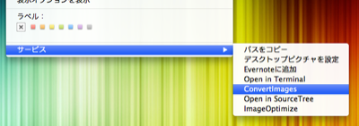
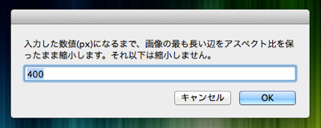

# Convert Images.workflow

* ImageOptim.app を利用して、画像ファイルを最適化します。
* 指定されたピクセルサイズまでアスペクト比を保ったまま縮小します。
* 画像縮小は、縦・もしくは横の内、最も長い辺を基準とします。


## 必要条件

画像ファイル最適化のために、[ImageOptim.app](http://imageoptim.com/) のインストールが必要です。


## 使い方

* 画像ファイル、もしくはフォルダを選択します。
* `ctrl+click`（2本指タップ、右クリック）で表示されるメニューから、`サービス` - `Convert Images` を選択します。  

* 最大の画像幅をピクセルで指定します。  

* デスクトップの `ConvertImages` フォルダに変換された画像がコピーされます。


## 設定

AppleScript の修正により、下記に対応します。

### アクションのカスタマイズ

以下のシンプルな構成に変更しました。
これにより画像処理用の Automator アクションの追加・変更がしやすくなりました。

```
Base Script (AppleScript)
    :
Automator アクション (画像処理)
    :
ImageOptim Script (AppleScript)
```


### 初期値の設定項目を追加

以下の項目の設定変更を容易にしました。

* 作業用フォルダ名 - Base Script と ImageOptim Script の defaultFolder を修正。
* 最大ピクセル数 - Base Script の defaultMaxpxl を修正。


### ImageOptim-CLI に対応

[ImageOptim-CLI](http://jamiemason.github.io/ImageOptim-CLI/) をインストールしている場合は、そちらを利用できるよう設定を追加しました。

* Base Script の myScript を、which で表示される ImageOptim-CLI へのパスに修正。

```
% which imageOptim
/Users/****/.nodebrew/current/bin/imageOptim
```
