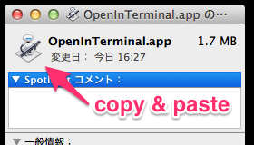

# OpenInTerminal.app

利用しやすいようアプリ形式で用意しました。  
設定を確認して下さい。

* Finder で開いているディレクトリを Terminal.app で開きます。
* ディレクトリ foo を Terminal.app で表示するために、アプリ起動と `$ cd foo` します。

## 設定

使いやすくするために簡単な設定をします。

* 標準では `Otto (the Automator robot)` のアイコンが表示されます。  
`cmd+i` で開いたウィンドウから、コピー＆ペーストでアイコンを変更できます。  
  
ここでは Terminal.app のアイコンを利用しました。
* アプリを Finder のツールバーに登録します。  

* 登録が終わったら、アプリケーションフォルダーに移動して完了です。  

## 使い方

* Finder ツールバーのアプリアイコンをクリックします。  

## OpenInTerminal.workflow

.workflow 形式のファイルも用意しました。  
選択したファイル・フォルダーの上位ディレクトリが開きます。
