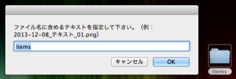

# RenameFiles.workflow

* 指定したファイルのファイル名を「年月日」「指定したテキスト」「連番」という形式にリネームします。  
`YYYY-MM-DD_[text]_NN.EXTENTION`
* Finderのファイル名順を連番に整形します。

Automator.app で、条件の変更が可能です。

## 使い方

* ファイル、もしくはフォルダを選択します。
* `ctrl+click`（2本指タップ、右クリック）で表示されるメニューから、`サービス` - `RenameFiles` を選択します。  
* ファイル名に含める共通のテキストを指定します。  
フォルダが指定されていればフォルダ名、ファイルの場合はファイル名が初期値に入ります。  

* デスクトップの `RenameFiles` フォルダに変換されたファイルがコピーされます。
